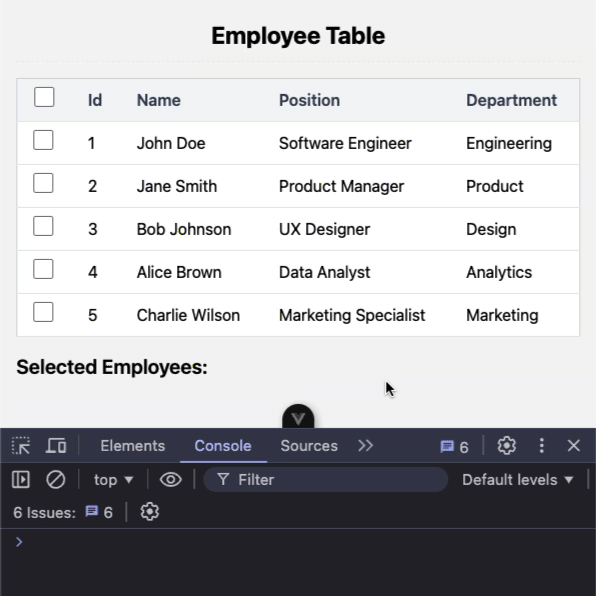

# Employee Table Bug Challenge

## Challenge Description

In this challenge, you are tasked with fixing a list rendering performance issue.

The challenge will require that you work in `AppTable.vue` and `AppTableRow.vue`.

## Requirements

When selecting a row in the table all `AppTableRow` components will be re-rendered. However, we only need to re-render the changed Item. Fix this issue:

- Selecting a row should only trigger the re-render of that row

> 💡 HINT: We have added a console log that runs every time a row is re-rendered. Check the console for a message like: "Rendered row with id: [row id here]" to help debug the unnecessary row renders

